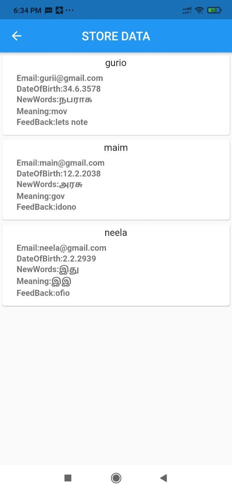

# firebasecrud

A new Flutter project.

## Getting Started

A few resources to get you started if this is your first Flutter project:
    Any Operating System (ie. Linux, Windows,MacOS X).
    Any IDE with Flutter SDK installed (ie. Android Studio, VSCode, IntelliJ, etc).
    A little knowledge of Dart and Flutter Documentation.
